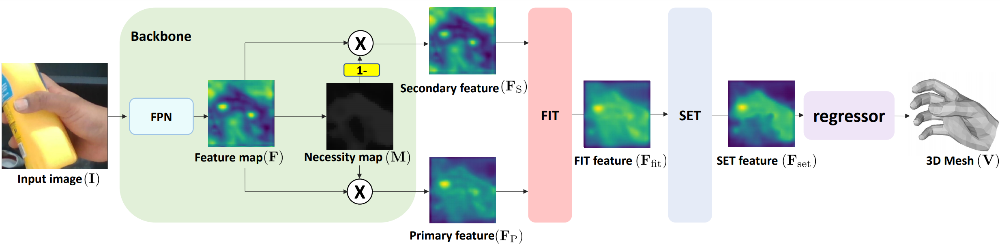
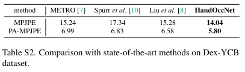

# HandOccNet: Occlusion-Robust 3D Hand Mesh Estimation Network

## Introduction
This repository is the offical [Pytorch](https://pytorch.org/) implementation of **[HandOccNet: Occlusion-Robust 3D Hand Mesh Estimation Network (CVPR 2022)](https://arxiv.org/abs/2203.14564)**. Below is the overall pipeline of HandOccNet.


## Quick demo
* Install **[PyTorch](https://pytorch.org)** and Python >= 3.7.4 and run `sh requirements.sh`.
* Download `snapshot_demo.pth.tar` from [here](https://drive.google.com/drive/folders/1OlyV-qbzOmtQYdzV6dbQX4OtAU5ajBOa?usp=sharing) and place at `demo` folder.
* Prepare `input.jpg` at `demo` folder.
* Download `MANO_RIGHT.pkl` from [here](https://mano.is.tue.mpg.de/) and place at `common/utils/manopth/mano/models`.
* Go to `demo` folder and edit `bbox` in [here](https://github.com/namepllet/HandOccNet/blob/185492e0e5b08c47e37039c5d67e3f2b099a6f9e/demo/demo.py#L61).
* Run `python demo.py --gpu 0` if you want to run on gpu 0.
* You can see `hand_bbox.png`, `hand_image.png`, and `output.obj`.

## Directory
### Root  
The `${ROOT}` is described as below.  
```  
${ROOT}  
|-- data  
|-- demo
|-- common  
|-- main  
|-- output  
```  
* `data` contains data loading codes and soft links to images and annotations directories.  
* `demo` contains demo codes.
* `common` contains kernel codes for HandOccNet.  
* `main` contains high-level codes for training or testing the network.  
* `output` contains log, trained models, visualized outputs, and test result.  

### Data  
You need to follow directory structure of the `data` as below.  
```  
${ROOT}  
|-- data  
|   |-- HO3D
|   |   |-- data
|   |   |   |-- train
|   |   |   |   |-- ABF10
|   |   |   |   |-- ......
|   |   |   |-- evaluation
|   |   |   |-- annotations
|   |   |   |   |-- HO3D_train_data.json
|   |   |   |   |-- HO3D_evaluation_data.json
|   |-- DEX_YCB
|   |   |-- data
|   |   |   |-- 20200709-subject-01
|   |   |   |-- ......
|   |   |   |-- annotations
|   |   |   |   |--DEX_YCB_s0_train_data.json
|   |   |   |   |--DEX_YCB_s0_test_data.json
``` 
* Download HO3D(version 2) data and annotation files [[data](https://www.tugraz.at/institute/icg/research/team-lepetit/research-projects/hand-object-3d-pose-annotation/)][[annotation files](https://drive.google.com/drive/folders/1pmRpgv38PXvlLOODtoxpTYnIpYTkNV6b?usp=sharing)]
* Download DexYCB data and annotation files [[data](https://dex-ycb.github.io/)][[annotation files](https://drive.google.com/drive/folders/1pmRpgv38PXvlLOODtoxpTYnIpYTkNV6b?usp=sharing)] 

### Pytorch MANO layer
* For the MANO layer, I used [manopth](https://github.com/hassony2/manopth). The repo is already included in `common/utils/manopth`.
* Download `MANO_RIGHT.pkl` from [here](https://mano.is.tue.mpg.de/) and place at `common/utils/manopth/mano/models`.

### Output  
You need to follow the directory structure of the `output` folder as below.  
```  
${ROOT}  
|-- output  
|   |-- log  
|   |-- model_dump  
|   |-- result  
|   |-- vis  
```  
* Creating `output` folder as soft link form is recommended instead of folder form because it would take large storage capacity.  
* `log` folder contains training log file.  
* `model_dump` folder contains saved checkpoints for each epoch.  
* `result` folder contains final estimation files generated in the testing stage.  
* `vis` folder contains visualized results.  

## Running HandOccNet
### Start  
* Install **[PyTorch](https://pytorch.org)** and Python >= 3.7.4 and run `sh requirements.sh`.
* In the `main/config.py`, you can change settings of the model including dataset to use and input size and so on.  

### Train  
In the `main` folder, set trainset in `config.py` (as 'HO3D' or 'DEX_YCB') and run  
```bash  
python train.py --gpu 0-3
```  
to train HandOccNet on the GPU 0,1,2,3. `--gpu 0,1,2,3` can be used instead of `--gpu 0-3`.

### Test  
Place trained model at the `output/model_dump/`.
  
In the `main` folder, set testset in `config.py` (as 'HO3D' or 'DEX_YCB') and run  
```bash  
python test.py --gpu 0-3 --test_epoch {test epoch}  
```  
to test HandOccNet on the GPU 0,1,2,3 with {test epoch}th epoch trained model. `--gpu 0,1,2,3` can be used instead of `--gpu 0-3`.

* For the HO3D dataset, pred{test epoch}.zip will be generated in `output/result` folder. You can upload it to the [codalab challenge](https://competitions.codalab.org/competitions/22485) and see the results.
* Our trained model can be downloaded from [here](https://drive.google.com/drive/folders/1OlyV-qbzOmtQYdzV6dbQX4OtAU5ajBOa?usp=sharing)

## Results  
Here I report the performance of the HandOccNet.
<p align="center">

</p>

<p align="center">

</p>

## Reference
```  
@InProceedings{Park_2022_CVPR_HandOccNet,  
author = {Park, JoonKyu and Oh, Yeonguk and Moon, Gyeongsik and Choi, Hongsuk and Lee, Kyoung Mu},  
title = {HandOccNet: Occlusion-Robust 3D Hand Mesh Estimation Network},  
booktitle = {Conference on Computer Vision and Pattern Recognition (CVPR)},  
year = {2022}  
}  
```
## Acknowledgements
For this project, we relied on research codes from:
* [I2L-MeshNet_RELEASE](https://github.com/mks0601/I2L-MeshNet_RELEASE)
* [Semi-Hand-Object](https://github.com/stevenlsw/Semi-Hand-Object)
* [attention-module](https://github.com/Jongchan/attention-module)